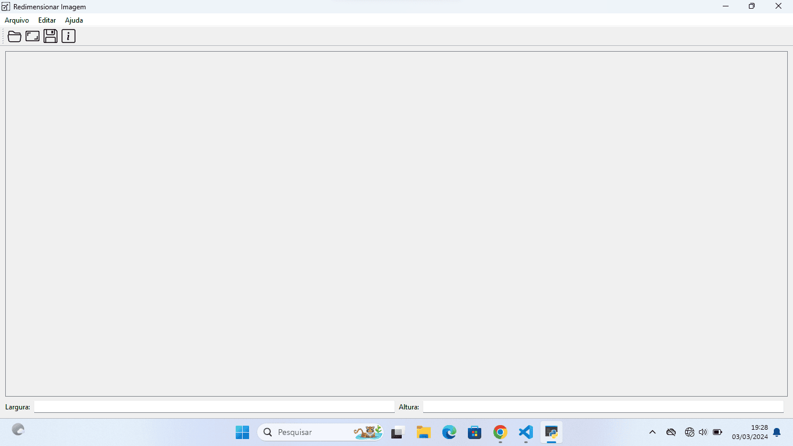
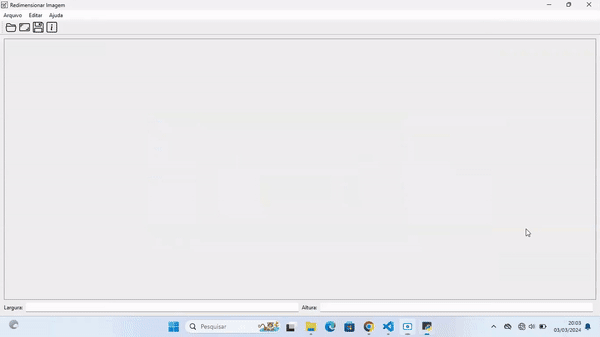
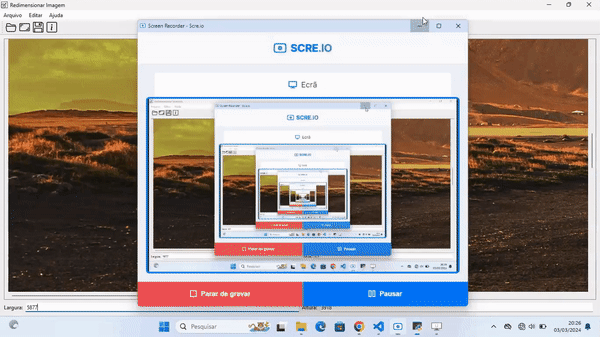
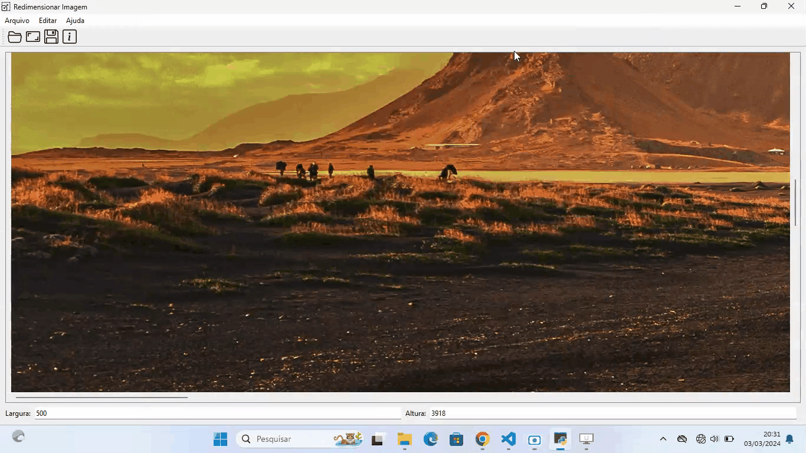
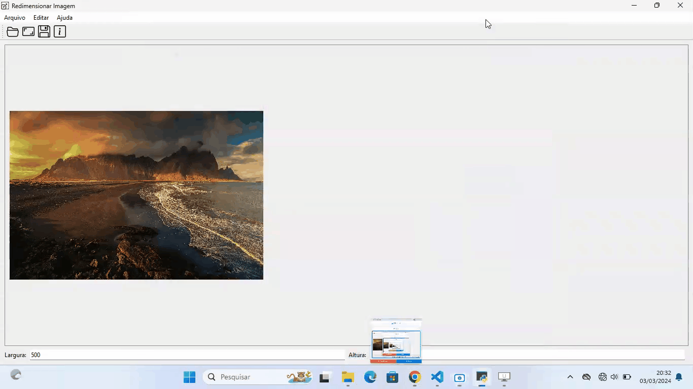
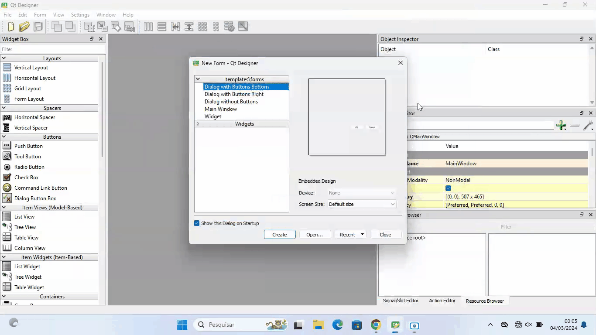
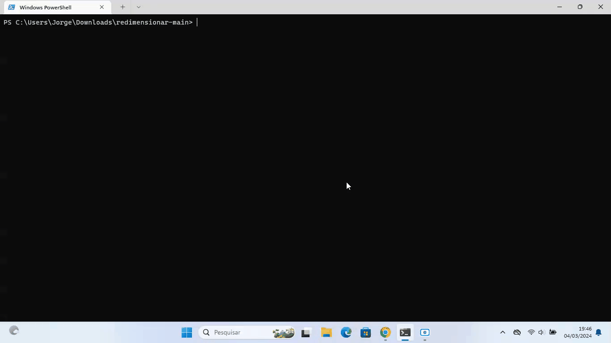
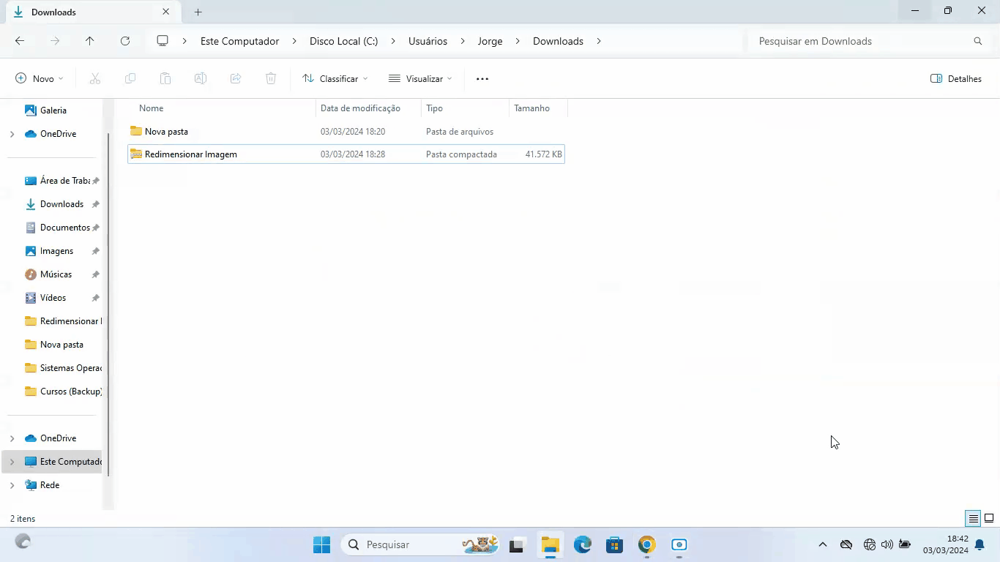

# Redimensionar Imagem

#### É um programa que permite definir uma nova largura e altura em pixels de qualquer imagem.

#### Demonstração

###### Escolha uma imagem (Atalho: CTRL + O)

###### Defina uma nova largura para a imagem (Obs: não é necessário alterar a altura, porque a nova altura será calculada automaticamente com base na nova largura)

###### Clique em Editar e depois em Redimensionar (Atalho: CTRL + R)

###### Clique em Abrir e depois em Salvar, a imagem será salva no formato de PNG (Atalho: CTRL + S)

###### O programa tem esses ícones, que são atalho para abrir, redimensionar e salvar imagem.
*  Abrir imagem.
*  Redimensionar imagem.
*  Salvar imagem.
*  Informações sobre o programa.

## 🛠️ Tecnologias e Ferramentas usadas na construção do projeto:

* [Visual Studio Code](https://code.visualstudio.com/) - é um editor de código.
* [Qt Designer](https://build-system.fman.io/qt-designer-download) - é uma ferramenta para projetar e construir interfaces gráficas.
* [PySide6](https://doc.qt.io/qtforpython-6/quickstart.html#quick-start) - é uma biblioteca de interface gráfica em Python.
* [Python](https://www.python.org/downloads/) é uma linguagem de programação, no caso foi usado versão 3.12 do Python.

###### Foi disponibilizado nesse repositório o arquivo [designer.ui](https://github.com/devjorgesousa/redimensionar/blob/main/designer.ui), se quiser abrir no [Qt Designer](https://build-system.fman.io/qt-designer-download) e ver como foi criado a interface gráfica desse projeto.

  
## 📋 Pré-requisitos

###### Instale a versão 3.12 do Python:
* [Python](https://www.python.org/downloads/)

## 🎲 Rodando o Projeto

##### Clone este repositório:
* git clone https://github.com/devjorgesousa/redimensionar.git

##### Acesse a pasta do projeto no terminal/cmd ou Visual Studio Code, após descompactar o arquivo redimensionar-main.zip:
* cd redimensionar-main

##### Instale o [pipenv](https://pipenv.pypa.io/en/latest/):
* pip install pipenv 

###### "O pipenv é uma ferramenta para o gerenciamento de dependências em projetos Python, unindo Pipfile, pip e virtualenv em uma única ferramenta. Ele cria automaticamente o virtualenv e gerencia as suas dependências."

##### Crie um ambiente virtual do pipenv:
* pipenv shell

##### Instale as dependências:
* pipenv install

##### Execute a aplicação:
* python3 main.py

## 📦 Implantação

#### Leia a documentação do PySide6: https://doc.qt.io/qtforpython-6/deployment/index.html

##### Optei usar o [PyInstaller](https://pyinstaller.org/en/stable/) para criar um executável .exe

##### "PyInstaller agrupa um aplicativo Python e todas as suas dependências em um único pacote. O usuário pode executar o aplicativo empacotado sem instalar um interpretador Python ou qualquer módulo. PyInstaller é testado em Windows, MacOS X e Linux. No entanto, não é um compilador cruzado; para fazer um aplicativo Windows você executa o PyInstaller no Windows, e para fazer um aplicativo Linux você o executa no Linux, etc."

##### 🔧 ZIP
###### O executável gerado pelo PyInstaller foi compactado em ZIP:
[Clique aqui para baixar o arquivo ZIP no Driver Google](https://drive.google.com/file/d/180crcJylCdTzQL3ATgVIz4qY8k8m-t42/view?usp=sharing).

##### 🔧 Instalador 
###### Utilizei um software chamado [Inno Setup](https://jrsoftware.org/isdl.php#stable), que serve para criação de instaladores para arquivos executáveis:
[Clique aqui para baixar o instalador no Driver Google](https://drive.google.com/file/d/1NxJynTmMNL2KWnmtFMDmD5jNX336u1M8/view?usp=sharing).

